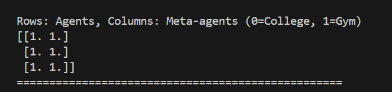
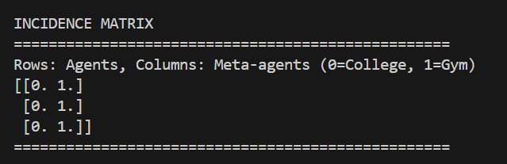
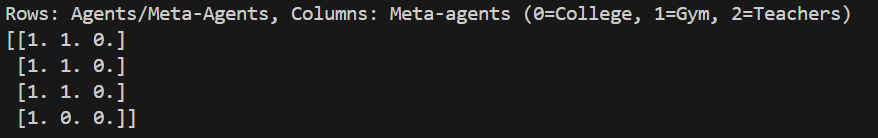

# Meta-Agent Prototype (GSoC)

This repository is a prototype for a GSoC project exploring meta-agents and group membership in agent-based models.

**What it does:**
- Models agents and groups (meta-agents) with flexible join/leave rules.
- Uses a sparse matrix to efficiently track which agents belong to which groups.
- Supports custom approval logic for joining/leaving groups.

**How to run:**
- From the repo root: `python -m mesa_meta.example`

**Code structure:**
- `Agent`: Represents an individual entity.
- `MetaAgent`: Represents a group; manages membership and rules.
- `Policy`: Configures join/leave/exclusivity logic.
- `Hypergraph`: Sparse matrix backend for group membership.
- `example.py`: Shows how to use the system.

This is a starting point for more advanced agent-based modeling and group dynamics.

---


**Lifecycle:**

**Entity Creation:**
1. Individual `agents` are instantiated with their own properties.
2. `Meta-agents` (groups) are created to represent collections or hierarchical structures.

**Membership Decision:**
 Entities (both `agents` and `meta-agents`) evaluate potential membership based on:
   - Target `meta-agent` attributes (e.g., `rank`, `distance`, requirements)
   - Their own criteria and compatibility rules
   - Existing hierarchies (`meta-agents` can join other `meta-agents` for organizational nesting)

**Membership Application:**
   Only `agents` submit join/leave requests to `meta-agents`:
   -`Agents` request to join/leave groups with application flow
   - `Meta-agents` are `created` directly as part of parent `meta-agents` (no approval needed)
   - `Meta-agent` creation follows parent meta-agent's structural rules and requirements
   - **Why no approval?** Creating a child meta-agent is equivalent to an organizational subdivision forming under its parent. The parent decides the shape of its hierarchy ahead of time, so once the child meta-agent is instantiated inside the parent, it is already authorized, and only its members must go through approval.


**Policy & Approval:**
    Target `meta-agent` evaluates requests from agents using configured policies:
   - Applies role-based rules, capacity limits, and custom logic
   - Accepts or rejects agent applications based on policy configurations
   - Can delegate to leaders/managers for decision-making
   - Note: Meta-agent membership is determined at creation time, not through approval

**Membership Update:**
 `Approved` memberships are recorded in the `sparse matrix` (hypergraph structure)
   - Tracks `agent-to-group` relationships
   - Tracks` meta-agent-to-meta-agent` relationships (organizational hierarchy)

**Reaction Hooks:**
Both entities react to membership changes through `customizable callbacks`:
   - `Agent.on_join()` / `Agent.on_leave()`
   - `MetaAgent.on_member_join()` / `MetaAgent.on_member_leave()`
   - These allow side effects and state propagation through hierarchies

**joining** 
```
college(policy, hypergraph, join_func, leave_func)
           |
           v
   college.add(agent, wants_to_join)
           |
           v
    wants_to_join(agent?)
           |
        [if True]
           |
           v
    assess_join_func(agent)
           |
        [if True]
           |
           v
          add()
```
**leaving**

      
      college(..., leave_func)
            |
            v
        college.remove(agent, wants_to_leave)
            |
            v
         wants_to_leave(agent?)
            |
         [if True]
            |
            v
         assess_leave_func(agent)
            |
         [if True]
            |
            v
          remove()
      


# facade api :
`policy`:
Defines group rules such as join/leave behavior, authority structure, and exclusivity for setups like hierarchy or coalition.

`get_members()`
: Returns a list of all members.

`get_members_by_role("some_role")`
: Returns members with a specific role.

`get_active_members()`
: Returns all members in the "active" state.

`get_dormant_members()`
: Returns all members in the "dormant" state.

`get_leaders()`
: Shortcut to get members with the "leader" role.

# State Control
`activate(entity)`
: Sets a member's state to "active".

`deactivate(entity)`
: Sets a member's state to "dormant".


# incidence matrix/Outputs from my testings:


This is the incidence matrix when every agents want to join the school and gym
and cleared the criteria 



This is the incidence martix when the agent didnt wanted to join the school but wanted to join the gym


This is the incidence matrix where 
meta agent teacher is a part of school 

Before I was thinking to apply rules in the joining of meta_agent too then I thought In real life org under org exists because of the willness of the org 


# Bidirectional Hooks

Override these methods to make agents and groups react to membership changes.

### Agent Hooks
- `on_join(self, meta_agent)`: Called on the agent after it joins a group.
- `on_leave(self, meta_agent)`: Called on the agent after it leaves a group.

### Group (MetaAgent) Hooks
- `on_member_join(self, entity)`: Called on the group after a new member joins.
- `on_member_leave(self, entity)`: Called on the group after a member leaves.